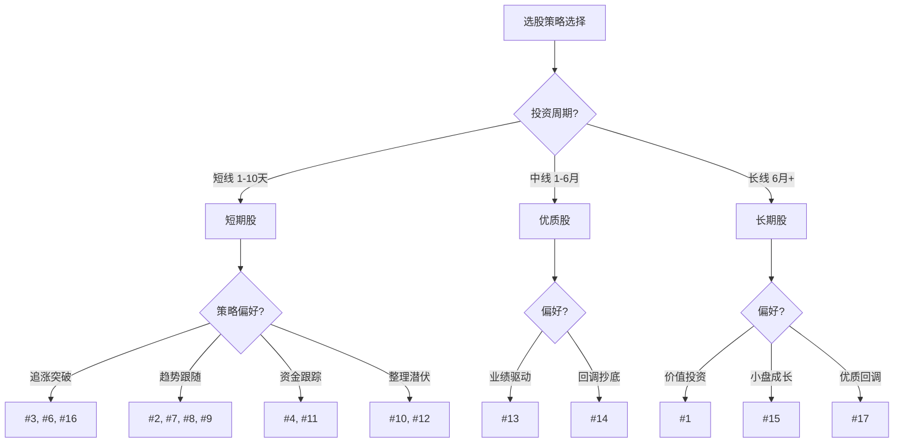

# 选股指标分类指南

本文档将 stock.md 中的 17 组选股指标按投资风格和周期进行分类，便于快速选择合适的策略。

---

## 🎯 短期股（短线/波段策略）

适用场景：持有周期 1-10 天，追求短期价差，风险较高。

| 编号 | 核心特征 | 关键指标 | 使用建议 |
|------|----------|----------|----------|
| #2 | 连续上涨+MACD金叉 | 连续上涨1-2天，换手率3%-8%，MACD金叉，OBV向上 | 捕捉短线启动，快进快出 |
| #3 | 放量突破50日新高 | 成交量>1.5倍，创50日新高，创业板 | 突破买入，追涨策略 |
| #4 | 温和上涨+高换手 | 涨幅3%-6%，量比2-5，换手率6%-15% | 主力吸筹，波段操作 |
| #6 | 事件驱动大涨 | 涨幅>5%，换手率>5%，创科/科创板 | 事件驱动，短线追高 |
| #7 | 放量均线向上 | 成交量100-5000万，5日均线上扬 | 量价配合，短线持有 |
| #8 | 活跃股均线多头 | 近50日涨停1-7次，均线多头排列 | 活跃股波段，趋势跟踪 |
| #9 | 中市值温和上涨 | 市值50-200亿，涨幅3%-5%，量比1-2 | 中线波段，稳健上涨 |
| #10 | 缩量整理 | 成交量缩小，5日收盘>10日均线 | 整理期潜伏，等待突破 |
| #11 | 大单流入+估值 | 5日大单净流入>0，市盈率10-1000倍 | 资金面主导，跟随主力 |
| #12 | 金叉+低估值 | 金叉，市盈率历史中位数以下 | 技术面+基本面共振 |
| #16 | 放量上涨长上影 | 量比>2，涨幅5%-10%，上影线长 | 高位谨慎，注意回落 |

---

## 🏢 长期股（中长线持有策略）

适用场景：持有周期 6 个月以上，注重基本面和长期价值。

| 编号 | 核心特征 | 关键指标 | 使用建议 |
|------|----------|----------|----------|
| #1 | 低估值+盈利增长 | 市销率0-5倍，毛利率增长≥-5%，上市>1年 | 价值投资，长线持有 |
| #15 | 小市值低波动 | 流通市值<50亿，振幅<5%，换手率1%-5% | 小盘成长，中长期布局 |

---

## 💎 优质股（基本面+安全边际）

适用场景：持有周期 1-6 个月，关注业绩和质量，风险可控。

| 编号 | 核心特征 | 关键指标 | 使用建议 |
|------|----------|----------|----------|
| #1 | 基本面稳健 | 市销率0-5倍，毛利率增长，成交额5000万-5亿 | 优质标的，安全边际高 |
| #13 | 业绩驱动 | 营收≥20亿，净利润增长>0，成交额>10亿 | 业绩兑现，基本面支撑 |
| #14 | 大市值抄底 | 流通市值50-1500亿，跌幅5%-10%，成交额>8亿 | 大盘蓝筹，回调买入 |
| #17 | 基本面+下跌 | 营收≥20亿，净利润>0，跌幅≤-3% | 优质股回调，低位布局 |

---

## 📈 分类决策树



---

## ⚠️ 风险等级与止损建议

| 风险等级 | 推荐指标编号 | 持有周期 | 止损建议 | 适合人群 |
|----------|--------------|----------|----------|----------|
| 低风险 | #1, #14, #17 | 1-6个月 | -8% | 稳健投资者 |
| 中风险 | #9, #10, #12, #13, #15 | 1-3个月 | -10% | 平衡型投资者 |
| 高风险 | #2, #3, #4, #6, #7, #8, #11, #16 | 1-10天 | -5% | 激进型投资者 |

---

## 📊 指标快速查询

### 按风险快速筛选

```bash
# 低风险指标
grep -E "^#1|^#14|^#17" stock.md

# 中风险指标
grep -E "^#9|^#10|^#12|^#13|^#15" stock.md

# 高风险指标
grep -E "^#2|^#3|^#4|^#6|^#7|^#8|^#11|^#16" stock.md
```

### 按投资周期快速筛选

```bash
# 短期股
grep -E "^#2|^#3|^#4|^#6|^#7|^#8|^#9|^#10|^#11|^#12|^#16" stock.md

# 长期股
grep -E "^#1|^#15" stock.md

# 优质股
grep -E "^#1|^#13|^#14|^#17" stock.md
```

---

## 📝 使用流程

1. **确定投资周期**：根据自身风险承受能力选择持有周期
2. **选择风险等级**：低/中/高风险对应不同止损策略
3. **匹配指标组合**：根据决策树选择合适的指标编号
4. **执行选股**：使用选股工具运行对应指标
5. **严格止损**：到达止损线果断离场

---

## 🔗 相关文件

- `stock.md` - 原始选股指标定义
